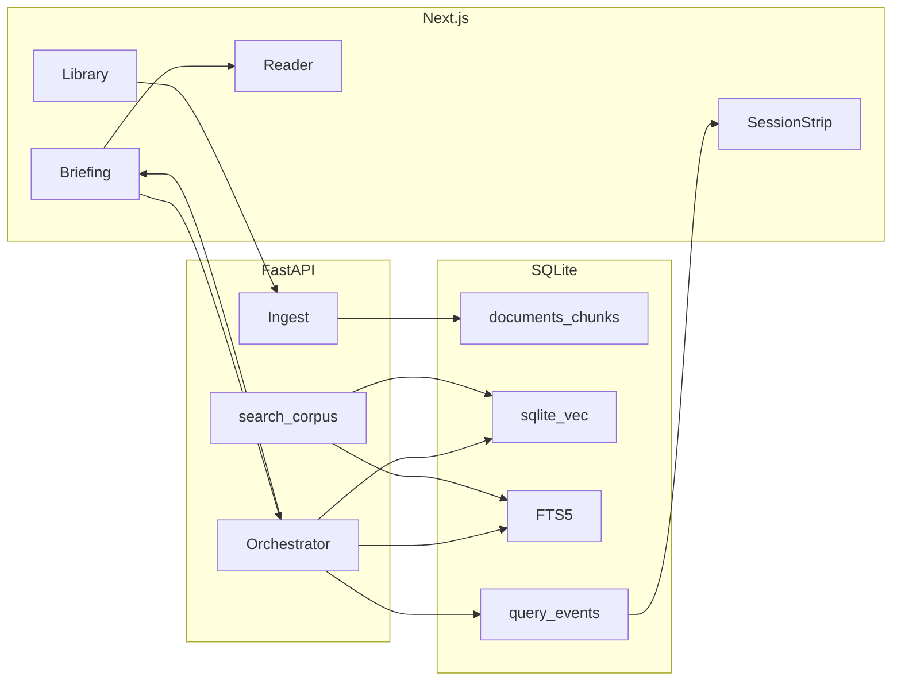

# Dossier

Grounded briefing from a document collection. Cite a passage or refuse.

**For a reviewer**

- [Design decisions](#design-decisions)
- [Trade-offs](#trade-offs)
- [What I would improve or add next](#what-i-would-improve-or-add-next)
- [Approach, solution, and key design decisions](#approach-solution-and-key-design-decisions)

Longer notes: [`docs/decision-memo.md`](docs/decision-memo.md), [`docs/prd.md`](docs/prd.md), stack table in [`plans/dossier.md`](plans/dossier.md#stack).

## 5-minute readout

**Problem.** An analyst has labels, guidance, and SOPs, and they need an answer they can show a colleague. Ctrl+F is slow, and a generic chatbot will invent a page number.

**Recommendation.** A thin RAG on one collection: retrieve, pack, generate, then drop any citation that was not retrieved, and if nothing survives, the answer is “Not in this dossier.”

**Shipped.** A local Docker / venv app, plus a stage deploy on my VPS so you can try it yourself. FastAPI and Next.js, SQLite with sqlite-vec and FTS5, hybrid RRF retrieve, follow-up rewrite that falls back to the raw question, an SSE brief, a three-pane desk, and a session strip for latency, estimated USD, and grounded or refused. MCP `search_corpus` sits on the same retrieve function, with offline eval and CI. No LangChain: the path is rewrite, retrieve, pack, cite-or-refuse, and I want that in one file a person can read and debug. Bring LangChain or LlamaIndex in later if you grow a real tool graph, need a pile of vendor SDKs, or the team already lives in that stack. Redis can wait too, until more than one API process must share sessions, rate limits, an ingest job queue, or live brief fan-out. One box and SQLite is enough for this test task.

**Deferred.** PDF.js page highlight, a recorded walkthrough, and OCR. Retrieval ranks stay behind `NEXT_PUBLIC_DEBUG=1`, off in the happy path, and PDF highlight was cut on purpose because Markdown/TXT `mark` + `?chunk=` is the path I can defend.

## Trade-offs

The hard part is not generating text, it is *not* generating unsourced text. A citation that lands on the wrong page is worse than a blank, and if the answer is not in the collection, I say so, every time.

I looked at the usual shortcuts and left them. Generic chat-with-PDF has no collection model, a weak refuse path, and nothing you can walk a colleague through. A web-browsing agent is the wrong source of truth, because the open web does not belong in this answer. Fine-tuning a model needs labelled data I do not have, and retrieval already answers “what is in *these* files.” Buying a vendor RAG is fine later; I needed something I can run, test, and read in an afternoon.

## Design decisions

What I did instead, and why it stays:

- **Cite or refuse** is the product, not a filter I bolted on. I drop any `chunk_id` the model invented, and if nothing survives, the answer is “Not in this dossier.” Empty retrieve skips the LLM.
- **SQLite in v1** so clone-and-run is one volume, not a Postgres container. The repository port is already there, and Postgres + pgvector is an adapter, not a rewrite.
- **Own orchestrator** so a reviewer can read the loop in one file: rewrite, retrieve, pack, cite-or-refuse. LangChain later, if the loop grows a real tool graph.
- **Embeddings opt-in** so a chat-only key cannot hit `/embeddings` with a chat model.
- **MCP shares `hybrid_search`.** One retrieve, two interfaces, and if HTTP and the tool disagree, I shipped a bug.
- **PDF.js skipped.** Highlighting a scanned page badly is worse than saying I highlight Markdown, so `mark` + `?chunk=` is the path I can defend.

If a reviewer cannot click a citation and land on the passage, or if refusal feels like an error instead of a trusted answer, this is a demo chatbot, not a briefing tool.

## What I would improve or add next

I would not spend the next stretch on looking more “production,” because one box and SQLite still hold for this task. The first thing that actually hurts is how slow and how thin document analysis is: ingest is synchronous, a large PDF blocks the request, the 10 MB cap is a bandage, and tables and figures get flattened into text, so a cite can miss a cell. Next money goes there, an async ingest worker, better table and figure extraction, and a text-layer PDF highlight so a citation can land on the page, not only on Markdown.

Proper object storage is the next honest move once the files are real. Originals belong in S3, or GCS, or Azure Blob, and the database should keep extracted text and vectors, not a pile of binaries on the API disk. I left the files on the box so I could spend the week on the briefing path, not on a bucket.

A standalone SQL database, Postgres + pgvector, not SQLite, earns its keep when there is more than one writer, or when I cannot copy the index onto every replica. The repository port is already there, so that swap is new SQL, not a rewrite, and I would not do it just to look ready.

Redis is the same kind of “not yet.” Skip it on one process, and bring it when two API workers must share sessions, rate limits, an ingest job queue, or live brief fan-out. Audio and video would force that queue anyway, a Whisper-class job, `ffmpeg`, timestamps, and a player that jumps to the cited second, so until then Redis is another moving part.

After that, if there is still time, a two-minute silent walkthrough so a reviewer does not have to guess the happy path, a cross-encoder rerank if hybrid retrieve starts missing, and SSO if more than one person is signing in for real. I would not spend the leftover hours on Kubernetes, LangChain, or a HIPAA program, those are different products.

## Approach, solution, and key design decisions

This is a take-home, and I treated it as a product a colleague could run, not as a slide deck with a repo attached. The bar I set is that a clone and a `.env` are enough, `make test` and `make eval` pass without a live key, and a reviewer can click a citation or see a refuse. If those fail, the rest is noise.

The approach was to name the real problem first. The job is not “chat with a PDF,” it is “answer from these files, show the passage, or say it is not there,” so I wrote the refuse rule and the golden set before I dressed the desk. Tests hold the retrieve, cite, and injection path. The loop is rewrite → retrieve → pack → generate → drop invented cites, corpus text is untrusted, and I did not start from a framework and fill in prompts later.

The solution is a thin RAG on one collection. FastAPI does ingest and the brief, and Next.js is the three-pane desk, library, reader, chat, plus a session strip for latency, estimated cost, and grounded or refused. The store is one SQLite file with sqlite-vec and FTS5, hybrid RRF on top, and MCP `search_corpus` calls the same retrieve function as HTTP. There is a stage box on my VPS if you would rather click than clone. Models are self-hosted by default so the papers stay on my side, and an OpenAI-compatible env swap is how you point at someone else’s API. The seed is public and synthetic, and this is not a clinical system.

The design calls I want a reviewer to notice are the ones that constrain the product. Cite-or-refuse is in the orchestrator, not a UI filter, SQL lives behind a port so Postgres is an adapter later, embeddings are opt-in so a chat key cannot hit the wrong endpoint, and debug ranks stay off unless you ask. I skipped PDF.js, Redis, object storage, and a second database on purpose, because clone-and-run mattered more than a diagram with every box filled in. LangChain would have hidden the loop I needed someone else to read. The longer notes are in `docs/decision-memo.md` and `docs/prd.md`, and this README is the submission.

## Try it (stage)

There is a live stage instance on my own VPS, my infrastructure, not a rented app host, and it is the same app as this repo. I left SQLite, and the other pieces, as standalone resources on that box so I could spend the test task on the product, not on moving the database or standing up a cluster. It is there so you can click around yourself, sign in, open a document, ask a question, and see a citation or a refuse. Stage, not production, so ask me for the URL if you do not have it.

The stage box talks to my own self-hosted models, **gpt-oss-120b-F16** for document research, and **Qwen3-VL-32B** for vision / document reasoning. That is on purpose: the papers stay on my side, and I am not paying a cloud API by the token. If you would rather use a third-party cloud model, OpenAI, Gemini, Claude, Mistral, and the like, that is a few env vars: point `LLM_BASE_URL`, `LLM_API_KEY`, and `LLM_MODEL` at their OpenAI-compatible endpoint and restart, no code change.

You can upload what I can turn into text and cite today: **PDF** (digital text; a scanned page with no text layer is refused, not silently empty), **Word** (`.docx`, `.docm`, old `.doc`), **Excel** (`.xlsx`, `.xlsm`, old `.xls`), **CSV**, **Markdown**, **plain text**, and **images** (PNG, JPEG, GIF, WebP, BMP). Images go through the vision model first (**Qwen3-VL-32B**) so I get the wording plus what the page looks like, and if that host is down or returns no boxes, I fall back to local **OCR** (RapidOCR) for printed text and for the highlight boxes on the picture. Cap is 10 MB per file. Sound and video are not in yet, and to add them I would need a speech-to-text model, a self-hosted Whisper-class job, same sovereignty idea, `ffmpeg` on the box to pull an audio track and a few frames from video, those frames through the vision model, then the usual chunk and retrieve path on the transcript with timestamps. Files that big also need async ingest, a higher size cap or object storage, and a player in the desk that can jump to the cited second, which is where Redis would earn its keep as the job queue. Same cite-or-refuse rule: if I cannot hear or see it, I say so.

**Cost / quality.** Self-hosted default is $0 (`PRICE_*_PER_1M=0`). Set those vars if you point at a billed API. Quality is the refuse rule plus `make eval` (hit-rate ≥ 0.8, refusal = 1.0), not a vibe check.

## Quick setup

```bash
cp .env.example .env   # add LLM_API_KEY if you want a live model
python3 -m venv .venv
.venv/bin/pip install -e "apps/api[dev]"
make test
make eval
make api-dev           # http://localhost:8000/healthz
```

UI: `cd apps/web && npm install && npm run dev` → http://localhost:3000. API must be on :8000.

Sign in as the seeded super admin:

- Email: `ASK_FROM_GEORGE`
- Password: `ASK_FROM_GEORGE`

That account can add other users from Settings. Changing its password in the desk is kept across restarts.

Or, once `.env` exists:

```bash
docker compose up --build
# desk http://localhost:18470  API http://localhost:18471/healthz
```

Those host ports are for Compose / Coolify stage / Cloudflare Tunnel. `make api-dev` and `npm run dev` stay on :8000 and :3000.

In the desk: the demo files are already in the library. Ask “What is the recommended dose?”, click the citation, then ask “Is there any X-ray related document?”

Default LLM host is an OpenAI-compatible ollama-swap (`LLM_BASE_URL` + `LLM_API_KEY` + `LLM_MODEL`). Point those at `https://api.openai.com/v1` to use OpenAI. Live embeddings run only if `EMBEDDING_MODEL` is set; a chat key must not send a chat model to `/embeddings`. Tests never need a key.

## Repos (private deploy, public share)

Coolify deploys from **GitLab** (`origin`). The team-facing copy is **GitHub**: [github.com/george-a-cs/dossier](https://github.com/george-a-cs/dossier). Do not point Coolify at GitHub.

```bash
git remote add public git@github.com:george-a-cs/dossier.git   # once
ssh -T git@github.com                                          # this machine's SSH key must be on the GitHub account
git push origin main && git push public main
```

`.env` stays gitignored. Lab URLs, API keys, and admin passwords live in `.env` and Coolify, not in git.

MCP (optional):

```bash
.venv/bin/pip install -e "apps/api[mcp]"
make mcp
```

## Architecture



Store: `data/dossier.db` (gitignored), WAL, sqlite-vec loaded on connect. `/readyz` is 503 if the extension is missing. Tests use a temp file.

```
dossier/
  apps/web/                 three-pane desk
  apps/api/dossier/         ingest, retrieve, generate, traces
  apps/mcp/                 thin FastMCP entry
  data/seed/                public synthetic corpus + golden.json
  docs/                     decision memo, PRD, playbook
```

SQL lives in `sqlite_repo.py` only. Routes → services → ports.

## Productionize later

v1 is a laptop (or CI) Compose stack. When it has to leave the laptop:

| Need | Move |
|---|---|
| Originals | Object storage (S3 / GCS / Azure Blob). DB keeps text + vectors |
| Writers / HA | **SQLite → RDS Postgres + pgvector** (or Cloud SQL / Azure Database) via the repository adapter. Same tables, new SQL. |
| Ingest | Async worker. Sync ingest is the bottleneck once PDFs get large |
| Shared cache / queue | **Redis** when you run more than one API worker: sessions, rate limits, ingest jobs, or fan-out of streaming briefs. Skip it on a single box. |
| Secrets | Manager + rotation. Never bake keys into the image |
| Access | Private net, WAF, rate limits, SSO |
| Telemetry | OpenTelemetry + an LLM trace store. I already persist timings and `citation_valid` |
| Quality | Keep `make eval` in CI. Add a live eval job behind a secret |
| PHI | Stop and get a BAA / audit story first. This repo is not that |

Scale the API horizontally. The index is the hard part: treat it as a service, not a file you copy onto every replica.

Containers on ECS Fargate / Cloud Run / Azure Container Apps before Kubernetes. I do not need a cluster for one briefing process.

**Not Vercel.** Vercel is fine for a standalone Next app. It is a bad host for this API: native sqlite-vec, a persistent SQLite file, and ingest/brief calls that outlive a serverless timeout. A split (Next on Vercel, API elsewhere) is possible later and adds parts I do not need now. If a URL is required, Fly.io or Railway with a volume is the honest next host.

## RAG / LLM

- **Models.** OpenAI-compatible `/chat/completions` and `/embeddings`. Default chat model name is `researcher-internal` (lab host; confirm what `/v1/models` actually lists). Tests use `FakeLlm` / `FakeEmbeddings`.
- **Index.** sqlite-vec kNN + FTS5. Hybrid RRF, `k_const=60`, top 8.
- **Orchestrator.** Custom: rewrite (if history) → embed → hybrid retrieve → pack (~3000 tokens) → stream → `verify_citations`. Rewrite cannot add web instructions; failure uses the raw question. No LangChain unless the loop outgrows one file.
- **Prompts.** Passages in `<source chunk_id=…>`. Corpus text is untrusted. Model must ignore instructions found inside sources.
- **Citations.** Trailing `{"chunk_ids":[…]}` stripped before display. UI renders `final.citations` only.
- **Refuse.** Zero kept ids → “Not in this dossier.” Empty retrieve skips the LLM.
- **Evals.** `data/seed/golden.json`. `make eval` is offline and required in CI.
- **Traces.** `query_events`: timings, tokens, cost, chunk ids, models, `citation_valid`, `refused`. No passage text in the row or the logs. The SSE `final` event also carries retrieve ranks; the desk shows them only when `NEXT_PUBLIC_DEBUG=1`.

## Standards

**Followed:** TDD on chunk, RRF, cite-verify, injection; typed API; Ruff; `tsc`; 12-factor env; secrets not in git; structured logs; Compose; CI; module boundaries.

**Skipped on purpose:** live cloud deploy, k8s, vendor SAST, auth/SSO, OCR, HIPAA program, 90% coverage, Langfuse. I did not run a usability session and I am not claiming one.

## How AI tools were used

Plan first (`plans/`), tests as the contract, review every diff. Assistants wrote boilerplate, CSS, test scaffolding, Compose, and CI YAML. I own the problem framing, chunk/retrieve/prompt choices, the refuse rule, and the narrative docs in `docs/` and this README. `AGENTS.md` is how I keep the next session from inventing LangChain or committing `.env`.

## More time

PDF.js when I have text-layer PDFs, a 2-3 minute silent walkthrough, async ingest, a Postgres adapter, a cross-encoder rerank. In that order.

## Screenshots

Intended stills and a Playwright capture script: `docs/screenshots/README.md`, `scripts/screenshots.mjs`. No video. This clone’s capture host was missing Chromium libraries; run the script where a browser can launch.

## Edge cases

| Case | What happens today |
|---|---|
| Scanned PDF | `unreadable_pdf`. No silent empty index |
| Tables / figures | Chunked as text. Expect missed cells |
| Huge dossiers | Sync ingest + 10 MB cap. Token pack drops the tail |
| Multilingual | FTS tokeniser is crude (`[A-Za-z0-9]+`). Vectors depend on the embedding model |
| Prompt injection | Source delimiters + verify + a golden injection item. Final text must not “diagnose the user” |
| Medical-advice misuse | Footer disclaimer. Seed is synthetic. This is not a clinical system |

See `docs/decision-memo.md`, `docs/prd.md`, `docs/playbook.md`, and `plans/dossier.md`.
