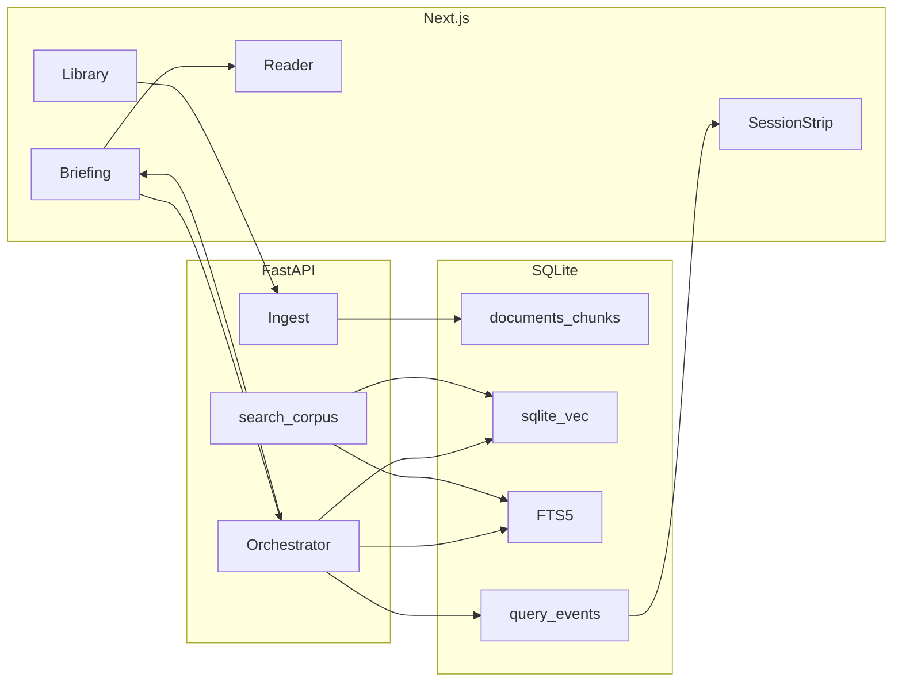

# Dossier

Grounded briefing from a document collection. Cite a passage or refuse.

## 5-minute readout

**Problem.** An analyst has labels, guidance, and SOPs. They need an answer they can show a colleague. Ctrl+F is slow. A generic chatbot will invent a page number.

**Recommendation.** A thin RAG on one collection. Retrieve, pack, generate, then drop any citation that was not retrieved. If nothing survives, the answer is “Not in this dossier.”

**Shipped.** Local Docker / venv app, plus a stage deploy on our VPS for a real try-yourself. FastAPI + Next.js. SQLite + sqlite-vec + FTS5. Hybrid RRF retrieve. Follow-up rewrite (falls back to the raw question). SSE brief. Three-pane desk. Session strip (latency, estimated USD, grounded/refused). MCP `search_corpus` on the same retrieve function. Offline eval + CI. No LangChain: the path is rewrite, retrieve, pack, cite-or-refuse, and we want that in one file a person can read and debug. Bring LangChain (or LlamaIndex) in later if you grow a real tool graph, need a pile of vendor SDKs, or the team already lives in that stack. Redis can wait too: consider it when more than one API process must share sessions, rate limits, an ingest job queue, or live brief fan-out. One box and SQLite is enough for this test task.

**Deferred.** PDF.js page highlight, a recorded walkthrough, OCR. Retrieval ranks stay behind `NEXT_PUBLIC_DEBUG=1`, off in the happy path. PDF highlight was cut on purpose: Markdown/TXT `mark` + `?chunk=` is the path we can defend.

## Try it (stage)

There is a live stage instance on our own VPS, our infrastructure, not a rented app host. Same app as this repo. We left SQLite (and the other pieces) as standalone resources on that box so we could spend the test task on the product, not on moving the database or standing up a cluster. It is there so you can click around yourself: sign in, open a document, ask a question, see a citation or a refuse. Stage, not production. Ask us for the URL if you do not have it.

The stage box talks to our own self-hosted models: **gpt-oss-120b-F16** for document research, and **Qwen3-VL-32B** for vision / document reasoning. That is on purpose: the papers stay on our side, and we are not paying a cloud API by the token. If you would rather use a third-party cloud model (OpenAI, Gemini, Claude, Mistral, and the like), that is a few env vars: point `LLM_BASE_URL`, `LLM_API_KEY`, and `LLM_MODEL` at their OpenAI-compatible endpoint and restart. No code change.

**Cost / quality.** Self-hosted default is $0 (`PRICE_*_PER_1M=0`). Set those vars if you point at a billed API. Quality is the refuse rule plus `make eval` (hit-rate ≥ 0.8, refusal = 1.0), not a vibe check.

## Quick setup

```bash
cp .env.example .env   # add LLM_API_KEY if you want a live model
python3 -m venv .venv
.venv/bin/pip install -e "apps/api[dev]"
make test
make eval
make api-dev           # http://localhost:8000/healthz
```

UI: `cd apps/web && npm install && npm run dev` → http://localhost:3000. API must be on :8000.

Sign in as the seeded super admin:

- Email: `george@csegoldi.com`
- Password: `Lets_Check@SomethingElse`

That account can add other users from Settings. Changing its password in the desk is kept across restarts.

Or, once `.env` exists:

```bash
docker compose up --build
# desk http://localhost:18470  API http://localhost:18471/healthz
```

Those host ports are for Compose / Coolify stage / Cloudflare Tunnel. `make api-dev` and `npm run dev` stay on :8000 and :3000.

In the desk: the demo files are already in the library. Ask “What is the recommended dose?”, click the citation, then ask “Is there any X-ray related document?”

Default LLM host is an OpenAI-compatible ollama-swap (`LLM_BASE_URL` + `LLM_API_KEY` + `LLM_MODEL`). Point those at `https://api.openai.com/v1` to use OpenAI. Live embeddings run only if `EMBEDDING_MODEL` is set; a chat key must not send a chat model to `/embeddings`. Tests never need a key.

MCP (optional):

```bash
.venv/bin/pip install -e "apps/api[mcp]"
make mcp
```

## Architecture



Store: `data/dossier.db` (gitignored), WAL, sqlite-vec loaded on connect. `/readyz` is 503 if the extension is missing. Tests use a temp file.

```
dossier/
  apps/web/                 three-pane desk
  apps/api/dossier/         ingest, retrieve, generate, traces
  apps/mcp/                 thin FastMCP entry
  data/seed/                public synthetic corpus + golden.json
  docs/                     decision memo, PRD, playbook
```

SQL lives in `sqlite_repo.py` only. Routes → services → ports.

## Productionize later

v1 is a laptop (or CI) Compose stack. When it has to leave the laptop:

| Need | Move |
|---|---|
| Originals | Object storage (S3 / GCS / Azure Blob). DB keeps text + vectors |
| Writers / HA | **SQLite → RDS Postgres + pgvector** (or Cloud SQL / Azure Database) via the repository adapter. Same tables, new SQL. |
| Ingest | Async worker. Sync ingest is the bottleneck once PDFs get large |
| Shared cache / queue | **Redis** when you run more than one API worker: sessions, rate limits, ingest jobs, or fan-out of streaming briefs. Skip it on a single box. |
| Secrets | Manager + rotation. Never bake keys into the image |
| Access | Private net, WAF, rate limits, SSO |
| Telemetry | OpenTelemetry + an LLM trace store. We already persist timings and `citation_valid` |
| Quality | Keep `make eval` in CI. Add a live eval job behind a secret |
| PHI | Stop and get a BAA / audit story first. This repo is not that |

Scale the API horizontally. The index is the hard part: treat it as a service, not a file you copy onto every replica.

Containers on ECS Fargate / Cloud Run / Azure Container Apps before Kubernetes. We do not need a cluster for one briefing process.

**Not Vercel.** Vercel is fine for a standalone Next app. It is a bad host for this API: native sqlite-vec, a persistent SQLite file, and ingest/brief calls that outlive a serverless timeout. A split (Next on Vercel, API elsewhere) is possible later and adds parts we do not need now. If a URL is required, Fly.io or Railway with a volume is the honest next host.

## RAG / LLM

- **Models.** OpenAI-compatible `/chat/completions` and `/embeddings`. Default chat model name is `researcher-internal` (lab host; confirm what `/v1/models` actually lists). Tests use `FakeLlm` / `FakeEmbeddings`.
- **Index.** sqlite-vec kNN + FTS5. Hybrid RRF, `k_const=60`, top 8.
- **Orchestrator.** Custom: rewrite (if history) → embed → hybrid retrieve → pack (~3000 tokens) → stream → `verify_citations`. Rewrite cannot add web instructions; failure uses the raw question. No LangChain unless the loop outgrows one file.
- **Prompts.** Passages in `<source chunk_id=…>`. Corpus text is untrusted. Model must ignore instructions found inside sources.
- **Citations.** Trailing `{"chunk_ids":[…]}` stripped before display. UI renders `final.citations` only.
- **Refuse.** Zero kept ids → “Not in this dossier.” Empty retrieve skips the LLM.
- **Evals.** `data/seed/golden.json`. `make eval` is offline and required in CI.
- **Traces.** `query_events`: timings, tokens, cost, chunk ids, models, `citation_valid`, `refused`. No passage text in the row or the logs. The SSE `final` event also carries retrieve ranks; the desk shows them only when `NEXT_PUBLIC_DEBUG=1`.

## Decisions worth defending

- **Cite or refuse** is the product, not a filter we bolted on.
- **SQLite in v1** so clone-and-run is one volume, not a Postgres container. Port is already there.
- **Own orchestrator** so a reviewer can read the loop in one file.
- **Embeddings opt-in** so a chat-only key cannot hit `/embeddings` with a chat model.
- **MCP shares `hybrid_search`.** One retrieve, two interfaces.
- **PDF.js skipped.** Highlighting a scanned page badly is worse than saying we highlight Markdown.

## Standards

**Followed:** TDD on chunk, RRF, cite-verify, injection; typed API; Ruff; `tsc`; 12-factor env; secrets not in git; structured logs; Compose; CI; module boundaries.

**Skipped on purpose:** live cloud deploy, k8s, vendor SAST, auth/SSO, OCR, HIPAA program, 90% coverage, Langfuse. We did not run a usability session and are not claiming one.

## How AI tools were used

Plan first (`plans/`), tests as the contract, review every diff. Assistants wrote boilerplate, CSS, test scaffolding, Compose, and CI YAML. Humans own the problem framing, chunk/retrieve/prompt choices, the refuse rule, and the narrative docs in `docs/` and this README. `AGENTS.md` is how we keep the next session from inventing LangChain or committing `.env`.

## More time

PDF.js when we have text-layer PDFs, a 2-3 minute silent walkthrough, async ingest, a Postgres adapter, a cross-encoder rerank. In that order.

## Screenshots

Intended stills and a Playwright capture script: `docs/screenshots/README.md`, `scripts/screenshots.mjs`. No video. This clone’s capture host was missing Chromium libraries; run the script where a browser can launch.

## Edge cases

| Case | What happens today |
|---|---|
| Scanned PDF | `unreadable_pdf`. No silent empty index |
| Tables / figures | Chunked as text. Expect missed cells |
| Huge dossiers | Sync ingest + 10 MB cap. Token pack drops the tail |
| Multilingual | FTS tokeniser is crude (`[A-Za-z0-9]+`). Vectors depend on the embedding model |
| Prompt injection | Source delimiters + verify + a golden injection item. Final text must not “diagnose the user” |
| Medical-advice misuse | Footer disclaimer. Seed is synthetic. This is not a clinical system |

See `docs/decision-memo.md`, `docs/prd.md`, `docs/playbook.md`, and `plans/dossier.md`.
