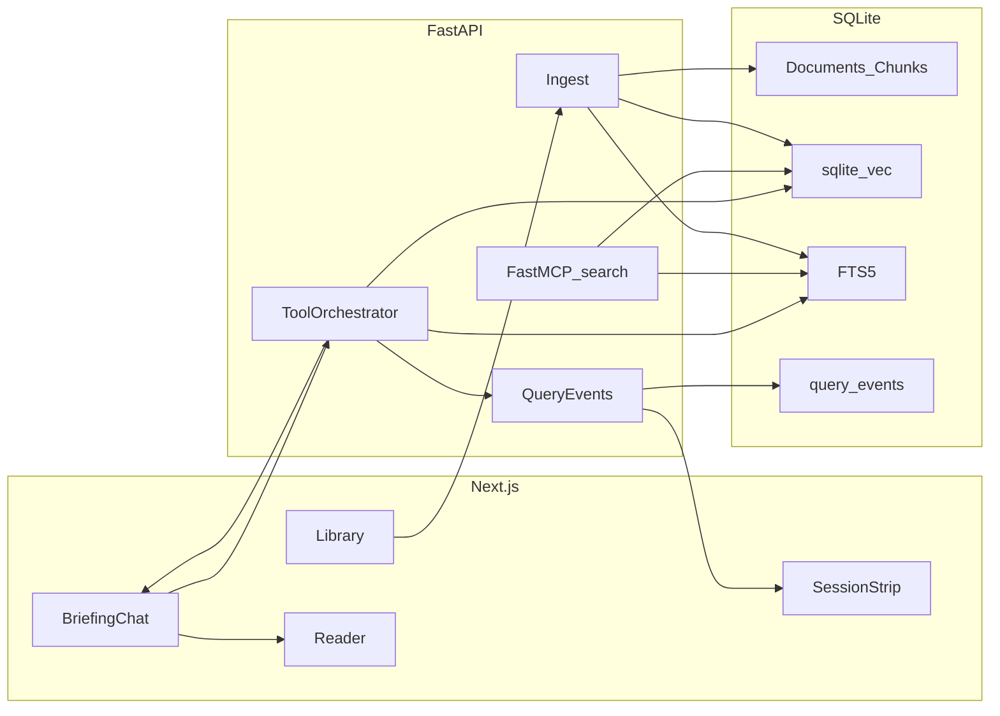

# Dossier — Product and engineering plan

Dossier is a collection-first document briefing assistant. It answers questions from an uploaded document set using retrieval-augmented generation, and every answer must be grounded in a cited passage or explicitly refused.

This is not a generic chat-with-PDF wrapper. The product is a **defensible brief**: show the source, or say it is not in the dossier.

## Problem

A Medical Affairs or Regulatory analyst needs answers from a document collection (labels, protocols, SOPs, public guidance). Today they Ctrl+F long PDFs, paste fragments into a chatbot, and cannot show *where* an answer came from. In life sciences, an unsourced answer is a liability.

**What has to be true for this to be useful**

- Citations are clickable and honest
- “I don’t know” is common and trusted
- Ingest is visible (parse → chunk → embed)
- Cost per brief is cheap enough for daily use

**Options considered and rejected**

- Generic chat-with-PDF — weak trust model; poor adoption
- Unconstrained web-browsing agent — wrong for a regulated source of truth
- Fine-tuning — no data and no need; retrieval plus prompts solve this
- Buy a vendor RAG / Copilot — a valid later option; this plan ships a thin system we can explain and own

**Domain constraints**

- Seed corpus is **public** documents only (for example a public label excerpt, a guidance snippet, a synthetic SOP)
- No PHI in fixtures or screenshots
- UI carries a “not medical advice / not a clinical system” disclaimer
- Production notes cover HIPAA, audit, and data residency if this ever leaves the demo corpus

## Product shape

**Persona:** Medical Affairs or Regulatory analyst preparing a sourced brief.

**Job to be done:** “Answer this from *our* documents, show me the passage, or tell me it isn’t there.”

**Happy path**

1. `docker compose up` and open Dossier
2. Load the one-click seed corpus, or upload PDF / Markdown / TXT
3. Watch ingest stages: parse → chunk → embed
4. Ask a briefing question
5. Get a streamed answer with citation chips; click a cite to jump to the highlighted passage
6. Ask something absent from the corpus and get an explicit refusal
7. See the session strip: groundedness, latency, estimated cost

**MVP scope:** single-user, one active collection, multi-document.

**Out of scope for v1:** auth, multi-tenant isolation, OCR for scanned PDFs, Kubernetes, live cloud deploy.

## Success metrics (in the product, not only in docs)

| Metric | How it is captured |
|---|---|
| Groundedness | Share of answers whose citations survive verification |
| Correct refusal | Unanswerable questions are refused |
| Latency | Embed / retrieve / LLM timings per query |
| Cost per brief | Token counts × configured unit price |
| Task completion proxy | Citation click-through (did the user verify?) |

These are written to `query_events` and shown on a small session strip in the UI.

## Stack

| Layer | Choice | Why | Rejected |
|---|---|---|---|
| UI | Next.js + React + TypeScript | Designed fullstack UI; one familiar React app | Vite-only extra glue with little benefit |
| API | FastAPI + Python 3.12 | Strong PDF/RAG tooling; easy to unit-test the pipeline | Next.js API-only (weaker parsing/test story) |
| Architecture | Modular monolith, 12-factor | Clean modules without microservice theatre | Premature service split |
| Data + vectors | SQLite file + **sqlite-vec** + FTS5 | Lives in the repo/volume; one process, no extra DB container; real vector index + BM25 | Postgres in v1 (heavier local story); Chroma; brute-force cosine only |
| Orchestration | Custom tool loop (~150 LOC) | Debuggable and explainable | LangChain / LangGraph soup for a thin RAG path |
| Connector | FastMCP server exposing `search_corpus` | Same retrieve function, second interface for tools/agents | Extra fake agents |
| Embeddings / LLM | OpenAI-compatible HTTP client (`base_url` + `api_key` + `model`) | Default: self-hosted ollama-swap. Flip env to OpenAI or any `/v1` proxy. One adapter, no SDKs per vendor. | Vendor-specific clients; fine-tune |
| Observability | structlog + `query_events` + health/ready | Habit without a SaaS dependency | Langfuse in v1 |
| CI | Lint, unit tests, retrieval eval | Quality as a pipeline, not a slide | Skipping CI |
| Run | Docker Compose **locally** | One command, persistent `./data` volume, sqlite-vec works | Vercel (see Deploy); Kubernetes |

Provider keys live in `.env` only (never committed). Persist `embedding_model` on the collection so vectors from two models are never mixed.

**Default LLM/embeddings:** self-hosted ollama-swap, OpenAI-compatible:

```
LLM_BASE_URL=https://gravi-lab-ollama.gravitonic.uk/v1
LLM_API_KEY=
LLM_MODEL=researcher-internal
EMBEDDING_BASE_URL=   # defaults to LLM_BASE_URL
EMBEDDING_API_KEY=    # defaults to LLM_API_KEY
EMBEDDING_MODEL=      # must be a model that serves /v1/embeddings on that host
```

Switch to OpenAI (or another `/v1` host) by changing those vars only:

```
LLM_BASE_URL=https://api.openai.com/v1
LLM_API_KEY=sk-...
LLM_MODEL=gpt-4o-mini
EMBEDDING_MODEL=text-embedding-3-small
```

Chat models on the lab host include `researcher-internal`, `content-generation`, `voice-fast`. Confirm which name exposes embeddings before locking `EMBEDDING_MODEL`. Tests stay on fake ports so CI needs no key.

**Production migrate path (not v1):** when writers, size, or HA matter, swap the repository to Postgres + pgvector + `tsvector`. Same logical model (collections, documents, chunks, embeddings, traces). Keep a thin `ChunkRepository` so that is an adapter change, not a rewrite.

## Architecture



**Store:** `data/dossier.db` (gitignored). Load the sqlite-vec extension on connect (the `sqlite-vec` Python package). WAL mode. Compose mounts `./data`. Tests use a temp file.

**Ingest:** upload → validate type/size → extract (page-aware PDF) → structure-aware chunk → embed → store chunk + sqlite-vec row + FTS5.

**Query:** optional follow-up rewrite → `retrieve` (hybrid RRF) → `generate` (stream, structured citations) → `verify_citations` (drop IDs that were not retrieved; refuse if none survive).

**MCP:** the same `retrieve` function bound as `search_corpus`, so the product HTTP path and a tool connector stay aligned.

## RAG approach

**Chunking.** Split on headings and paragraphs first, then a ~512-token window with ~64-token overlap. Never span documents. Metadata on every chunk: `document_id`, `filename`, `page_start`, `page_end`, `section_title`, `chunk_index`. Scanned PDFs with no text layer fail loudly. OCR is a named later step.

**Retrieval.** First slice: sqlite-vec kNN top-k (`k=8`) filtered by `collection_id`. Next slice: hybrid search with SQLite FTS5 and reciprocal rank fusion (helps names, doses, acronyms). No cross-encoder in v1; it is the next quality lever. The retrieve module talks to a repository interface so Postgres + pgvector can replace this later without touching the orchestrator.

**Prompt and context.** Document text is untrusted. Passages are delimited; the model is told to ignore instructions found inside them. Answer only from retrieved context; refuse when evidence is weak. Pack 6–8 chunks under a hard token budget. Keep the last 4 turns for follow-ups.

**Citations.** The model returns `chunk_id`s. The UI and `verify_citations` only keep IDs that were actually retrieved. A hallucinated page number is a product failure.

**Guardrails**

- MIME and size limits
- Injection fixture: a document that says “ignore previous instructions”
- Corpus-only (no web tools)
- Truncate document text in logs
- Disclaimer in the UI
- No PHI in seed data

**Evals.** Seed corpus plus `make eval` with about 10 golden items: answerable, unanswerable, and one injection. Score retrieval hit-rate, citation validity, and correct refusal. Retrieval tests always run in CI; LLM-scored items are optional behind a secret so CI can stay free.

**Observability.** Every query stores request id, embed/retrieve/LLM timings, tokens, estimated USD, chunk ids, model names, `citation_valid`, and `refused`. `/healthz` and `/readyz`. Optional retrieval drawer in development.

## UI

Three-pane **library / reader / briefing**. Editorial, paper-like reader — an analyst’s desk, not a centered chatbot.

- Empty state: seed corpus and one example briefing question
- Ingest stages and chunk counts
- Citation chips jump to a highlighted span
- “Based on N passages” vs “Not in this dossier”
- Session strip: last-query latency, estimated cost, grounded or refused
- Disclaimer footer

Skip auth walls, settings jungles, and marketing chrome.

## Repo layout

```
dossier/
  apps/web/              Next.js UI
  apps/api/              FastAPI: ingest, chunk, retrieve, orchestrator, traces
  apps/mcp/              FastMCP search_corpus (thin wrapper over retrieve)
  data/seed/             Public life-sciences docs + golden questions
  data/dossier.db        SQLite + sqlite-vec + FTS5 (gitignored, created on boot)
  docs/decision-memo.md  Problem, options, recommendation
  docs/prd.md            Users, metrics, acceptance criteria, definition of done
  docs/playbook.md       How to reuse this on the next collection
  plans/dossier.md         Product/engineering plan
  plans/implementation.md  Index → init/
  plans/init/              One file per wave (0–5)
  docker-compose.yml
  Makefile
  AGENTS.md              Conventions for AI-assisted development
  README.md
```

API modules stay separable: `parsing.py`, `chunking.py`, `embeddings.py`, `retrieve.py`, `orchestrator.py`, `schemas.py`. No god-object chain.

## Deploy

**v1 runs locally.** `docker compose up` on a laptop or CI runner. That is the supported environment: Next.js + FastAPI + `data/dossier.db` on a mounted volume.

**Not Vercel for this stack.** Vercel is a good host for a standalone Next.js app. It is a bad host for Dossier:

- The API is FastAPI with a native **sqlite-vec** extension, not a Node serverless function
- SQLite needs a **persistent disk**; Vercel’s filesystem is ephemeral
- Ingest and briefing queries are longer-lived than a typical serverless timeout
- Uploaded PDFs have to survive the next request

A split (Next.js on Vercel, API elsewhere) is possible later and adds moving parts we do not need for v1.

**What we write, not what we ship:** the README still explains how to productionize on AWS (primary), GCP, Azure, or Cloudflare — migrate SQLite → RDS + pgvector, object storage, secrets, SSO — because that is the “what would it take” question. We do not deploy a public URL in this phase.

**If a URL is needed later:** Fly.io (or Railway) with a Docker image and a volume is the honest next host, not Vercel.

## Engineering standards

**Follow:** TDD on chunking, RRF, citation verify, and injection; typed API contracts; Ruff and frontend lint; 12-factor config; secrets not in git; structured logs; Compose; CI; clean module boundaries.

**Defer on purpose (and say so in the README):** live cloud deploy, Kubernetes, vendor SAST/DAST, auth/SSO, OCR, a HIPAA program, 90% coverage, Langfuse.

## Delivery

Phased build (contracts, tests, acceptance): [init/README.md](./init/README.md). Do not start the next phase until the current one is green.

| Wave | Phases | Outcome |
|---|---|---|
| 0 Foundations | 0.1 skeleton → 0.2 health/config → 0.3 SQLite/repository | Clone, compose, `/healthz` |
| 1 Ingest | 1.1 parse → 1.2 chunk → 1.3 embed port → 1.4 ingest API + seed | Bytes in, chunks + vectors out |
| 2 Query | 2.1 vector retrieve → 2.2 pack/verify → 2.3 orchestrator → 2.4 SSE brief | Grounded answer via curl (**P0 backend**) |
| 3 UI | 3.1 frame → 3.2 library → 3.3 stream + chips | 3-minute briefing path (**P0 product**) |
| 4 Production-shaped | 4.1 hybrid RRF → 4.2 highlight → 4.3 traces → 4.4 MCP → 4.5 eval/CI → 4.6 docs | Submission bar (**P1**) |
| 5 Polish | 5.1 rewrite → 5.2 debug drawer → 5.3 screenshots/video | Only after Wave 4 |

If the clock dies: cut Wave 5, then MCP, then PDF highlight. Never cut citation verify, chunk tests, eval, or the README.

## Documentation to write (in our voice)

Keep notes while building; write the README last.

- **5-minute readout** at the top: problem, recommendation, what shipped, what was deferred, cost and quality posture
- Quick setup
- Architecture diagram
- What it would take to productionize on AWS / GCP / Azure / Cloudflare: object storage for originals; **migrate SQLite → RDS Postgres + pgvector** (or a managed vector store) via the repository adapter; async ingest worker (ingest is the bottleneck); private networking; secrets manager and rotation; WAF and rate limits; SSO; OpenTelemetry and an LLM trace store; eval in CI; HIPAA/BAA and audit logs if PHI appears; scale the API horizontally and treat the index as the hard part; containers on ECS Fargate / Cloud Run / Azure Container Apps before Kubernetes
- RAG and LLM decisions: models, embeddings, vector store, orchestration, prompts, context, guardrails, quality, observability
- Key technical decisions and why
- Standards followed and skipped
- How AI coding tools were used: plan first, tests as the contract, review every diff, humans write the memo / PRD / README / prompts; `AGENTS.md` makes it repeatable; no silent new dependencies
- What we would do with more time
- Known edge cases: scanned PDFs, tables, huge dossiers, multilingual text, prompt injection, medical-advice misuse

## AI-assisted development

- Assistants for boilerplate, CSS, test scaffolding, Compose, and CI YAML
- Humans own problem framing, chunk/retrieve/prompt choices, citation rules, and narrative docs
- Repeatable via `AGENTS.md` (module layout, untrusted documents, no LangChain, no PHI in fixtures)
- Do not commit `.env`, invent eval scores, or accept architecture we cannot defend

## Evidence for the demo

- Screenshots: seed library, ingest stages, grounded brief, citation jump, refusal, metrics strip
- Video only after P0 and P1 are solid
- A repo a technical sponsor can clone and run on Monday
